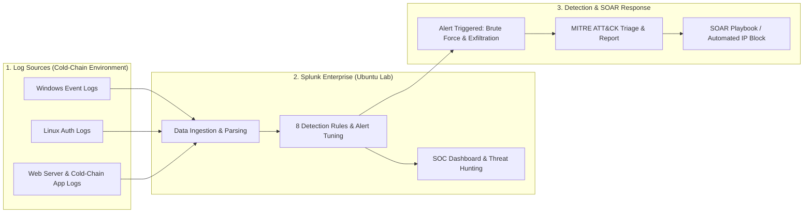

## Lab Architecture Diagram

```mermaid
flowchart LR
    subgraph Log_Sources["1. Log Sources (Cold-Chain Environment)"]
        A1[Windows Event Logs]
        A2[Linux Auth Logs]
        A3[Web Server & Cold-Chain App Logs]
    end

    subgraph Splunk_SIEM["2. Splunk Enterprise (Ubuntu Lab)"]
        B1[Data Ingestion & Parsing]
        B2[8 Detection Rules & Alert Tuning]
        B3[SOC Dashboard & Threat Hunting]
    end

    subgraph Incident_Response["3. Detection & SOAR Response"]
        C1[Alert Triggered: Brute Force & Exfiltration]
        C2[MITRE ATT&CK Triage & Report]
        C3[SOAR Playbook / Automated IP Block]
    end

    A1 & A2 & A3 --> B1
    B1 --> B2
    B2 --> B3
    B2 --> C1
    C1 --> C2 --> C3
```

